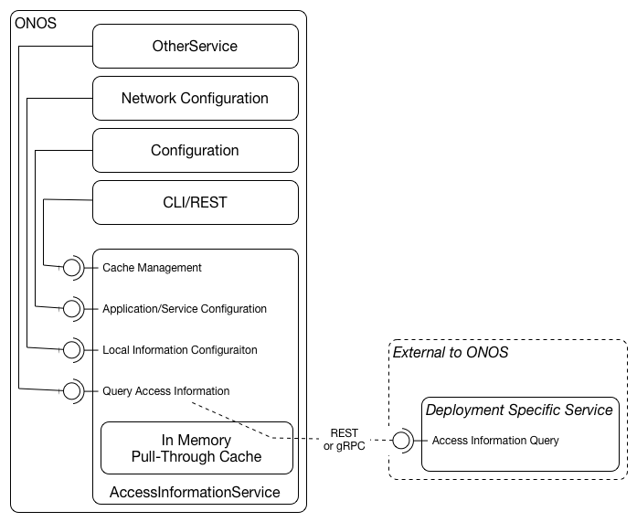

# Subscriber / Access Device Information Service (SADIS)

When deploying at a customer there is often a need to access per-subscriber /
access device information. This information is authoritatively stored by the
customer and made available to the residential CORD or VOLTHA deployment. The
purpose of this service is to define an optional service that provides a bridge
to the customer's infrastructure to query / cache subsciber/access information
and make it available to other services / applications within the ONOS/CORD
infrastructure.

### Overview

The below diagram is a high level block diagram for the Access Information
Service that runs as an ONOS application and will be used within the CORD/vOLTHA
context by other ONOS applications such as the DHCP Relay, iGMP, and AAA. The
basic concept is that the service can run in two modes: local mode - in local
mode the per subscriber / access device information can be established via
ONOS's network configuration capability. In this mode all queries are answered
based on the information from the network configuration remote mode - in the
remove mode the service is configured with a URL and this URL is used to query
an external source for subscriber / access device information using a URI
structure that is defined as part of this service. Information retrieved from
the external source is cached locally.



### Pull Through Cache

The cache used for the remote mode is considered a pull through cache in which
all queries are answered from the cache and if there is a cache miss the remote
API is used and the cache is populated.

To prevent the cache from growing indefinitely a policy, initially time/use
based, will be leveraged to kick / purge items from the cache. Additionally, the
cache can be influenced via manually operations of the the CLI/API exposed as
part of ONOS. The time limits for cache entry purging should be configurable.

### Service Configuration

The service is configurable via both the the network configuration as well as
via ONOS configuration. This configuration consists of service-wide properties
such as operation mode, remote URL, cache purge options, etc.

### Clustered Behavior

The in memory cache is not a clustered, distributed data structure, such that
each instance of ONOS in a cluster might have a different set of objects in its
cache. The thought behind this is that each instance in a cluster will be a
master for a different set of devices and thus needs different information.


### Configuration Paramters
```
"org.opencord.sadis" : {
      "sadis" : {
        "integration" : {
          "url": "http://localhost/src/test/resources/%s",
          "cache" : {
            "maxsize" : 50,
            "ttl" : "PT1m"
          }
        },
        "entries" : [ {
          "id" : "uni-1",
          "cTag" : 2,
          "sTag" : 2,
          "nasPortId" : "PON 1",
          "circuitId" : "VOLT-1",
        }, {
          "id" : "211702604597",
          "hardwareIdentifier" : "00:1e:67:d2:ef:66",
          "ipAddress" : "144.60.34.89",
          "nasId" : "66"
        }]
      }
    }
```
* __url__ - A url using which the subscriber and device data can be fetched. It is mandatory to have a `%s` in the url which will be substituted with the id for that subscriber/device to retrieve the data.
* __maxsize__ - Maximum number of entries that the cache may contain
* __ttl__ - Number of seconds after last access at which the cache entry expires

Entries can be for Subscribers and OLT Devices; they are differentiated by the id.
If the url is specified the data for the subscribers/devices are picked from there else the local data is used.

##### For a subscriber
* __id__ - Unique identifier for the subscriber. This should match the name of the logical port name for this subscriber as can be seen from the ONOS `ports` command
* __cTag__ - C-Tag to be used for this subscriber
* __sTag__ - S-Tag to be used for this subscriber
* __nasPortId__ - NAS Port Id to be used for this subscriber; for example in RADIUS messages
* __circuitId__ - Circuit Id to be used for this subscriber; for example in DHCP messages

##### For an OLT Device
* __id__ - Unique identifier for an OLT device. This should match the serial number of the device as can be seen from the ONOS `devices` command
* __hardwareIdentifier__ - MAC address for this device
* __ipAddress__ - IP address of this device
* __nasId__ - NAS Id to be used for this device; for example in RADIUS messages

